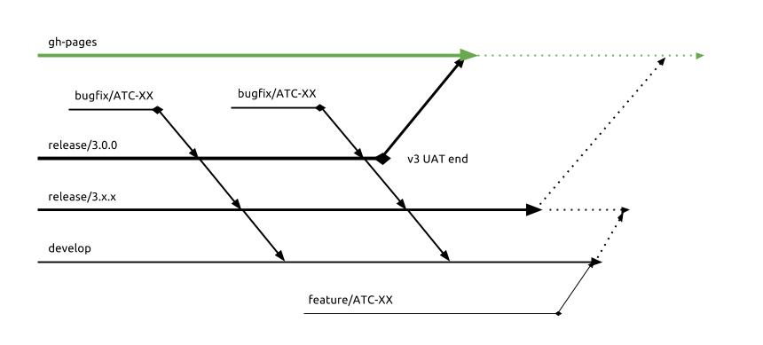

## Git Flow Process

Below you will find information about the main git branches as well as the overall branching strategy.

  

- **master** - represents the code that is deployed. only a release branch should merge into this branch. anytime a release branch is merged, you will need to run `npm run build`, commit the updated `bundle.min.js` and `bundle.min.css` files. then push the new changes and the build will execute on successful push.

- **bugfix/ATC-XX** - branches off of `release/3.0.0` for current `v3.0.0` bugfixes. should have a corresponding github issue where the `XX` in `ATC-XX` is the issue number. once a fix is finished, a pull request should be submitted targeting the branch it was created from.

- **release/x.x.x** (protected)- the next release and should be considered _stable_ code. any bugfixes should branch off of the current release branch. a new release branch will be cut from the previous release at the start of each sprint (approximately once a month). any bugfix that has been completed should have a pull request opened targeting the **current** release branch. there should rarely be any direct commits to this branch.

- **develop** - current working state with completed new features. should be in working order with no console errors or failing tests. new feature branches are created off of this branch. feature branches should be kept up to date with this branch by periodically performing `git pull origin develop`. there should rarely be any direct commits to this branch.

- **feature/XX** - new features or refactor work. should have a corresponding github issue where the `XX` is the issue number. features should only ever branch off `develop`. may contain code that is under active development. may have failing tests or non-working pieces. should stay current with `develop` and should be conflict free when submitting a PR. developer may open a [WIP] PR for visibility, though not required.
